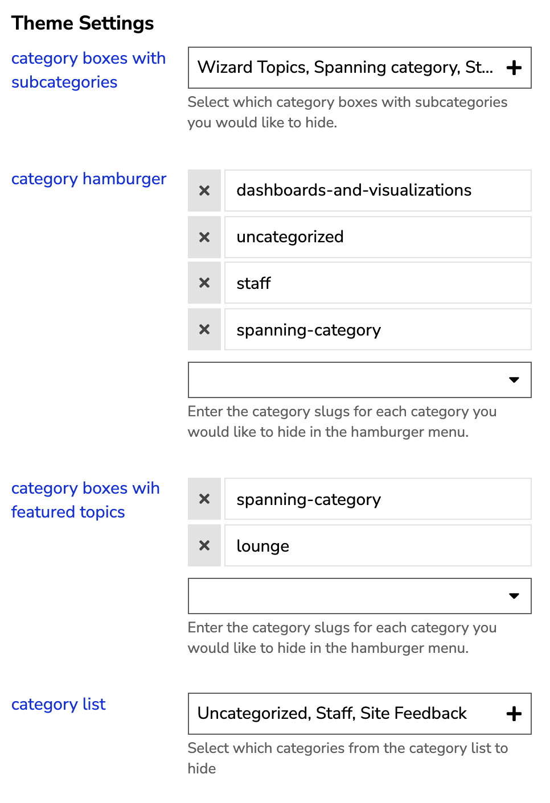

# Category Hider

## Discourse Theme Component

This is a [Discourse](https://discourse.org) theme component that allows you to hide specific categories from various locations in the Discourse UI.

### Why would you need this component?

If your Discourse website has a lot of categories and you would like to hide some from appearing in either the menu bar or on the main page, this component can be helpful.

This theme component is more of a stylistic change. It hides desired categories visually, but still keeps notifications and all other functionality for the category intact. To turn off all category features it is recommended to mute a category instead.

## General Info

|Plugin Name|[Discourse Category Hider](https://github.com/keegangeorge/discourse-hide-categories)|
|---|---|
|Author|[Keegan George](https://github.com/keegangeorge)|
|Version|2.1|
|Installation Guide|[Installing Theme Components](https://meta.discourse.org/t/how-do-i-install-a-theme-or-theme-component/63682)|
|Discourse Topic| [Read Topic](https://meta.discourse.org/t/category-hider-theme-component/181299)

## Installation

Below is a quick start guide to setup your discourse theme. A more comprehensive guide can be found [here](https://meta.discourse.org/t/how-do-i-install-a-theme-or-theme-component/63682).

<details>
<summary>View Guide</summary>

1. On your discourse website, navigate to:

   ```bash
   Admin > Customize > Themes > Components
   ```

2. Click `Install` and select `From a git repository`

3. Paste in the following link:

   ```bash
   https://github.com/keegangeorge/discourse-hide-categories
   ```

4. Navigate to your current theme and select it

5. Include the them component on your current theme.

</details>

## Preview

🔭 [Preview on theme creator](https://theme-creator.discourse.org/theme/keegan/category-hider)


_Before -> After_

<div style="display: flex;">
    </img>
    </img>
</div>

<br>

## Settings

In the settings, you can add what categories you would like to hide for different instances/areas where categories appear.

**You can hide categories in:**

- Category Boxes with Subcategories
- Hamburger Menu
- Category Boxes with Featured Topics
- Category List (this type always appears on mobile)
- Category Breadcrumb

For each setting use either the dropdown to select from the categories or enter the category slug.

</img>
