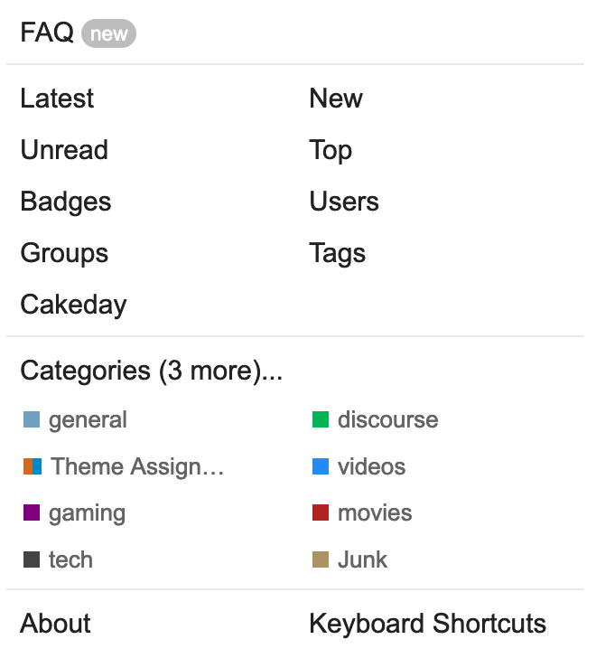
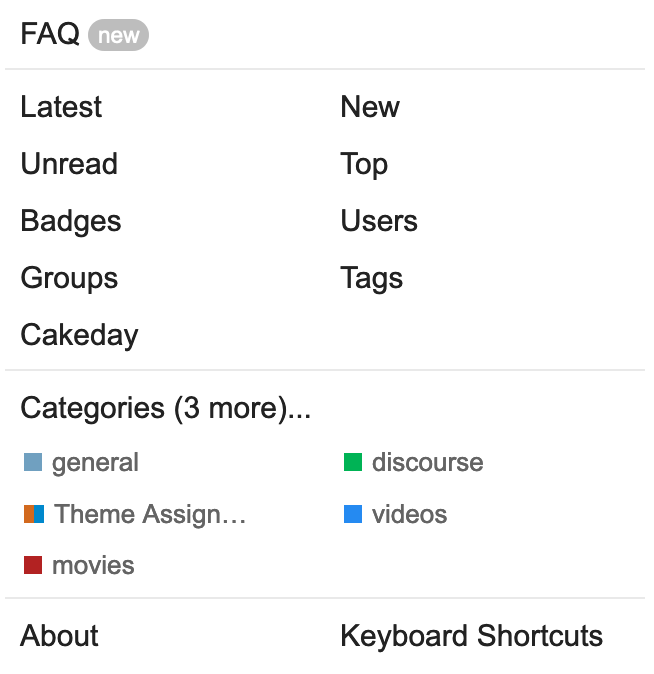
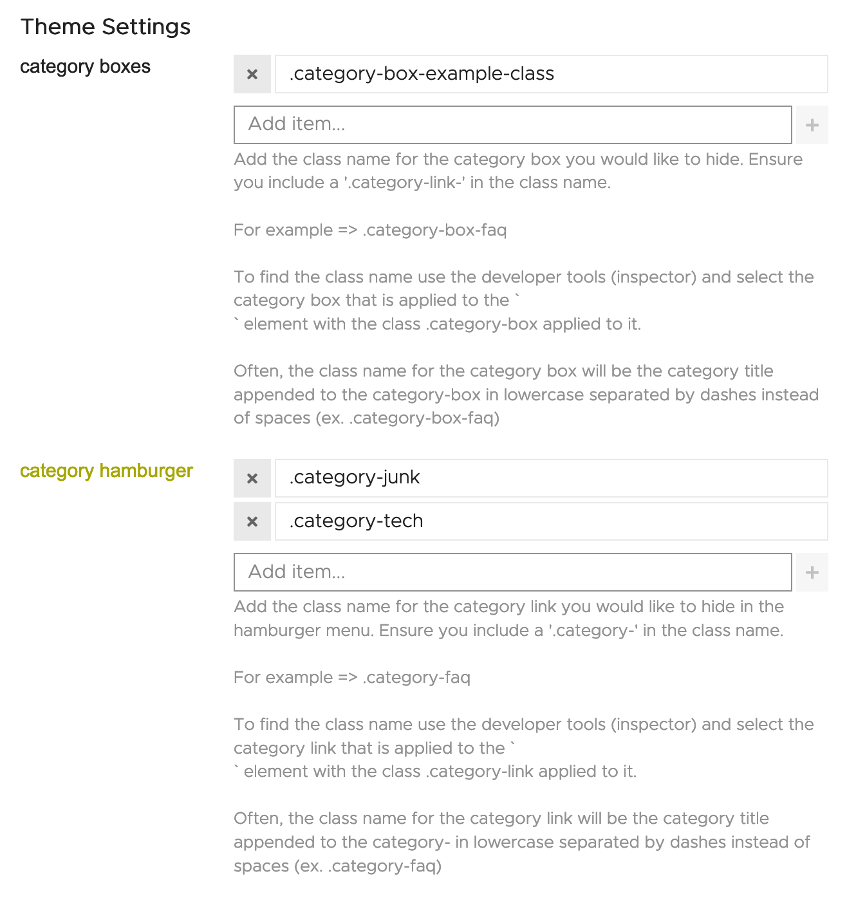
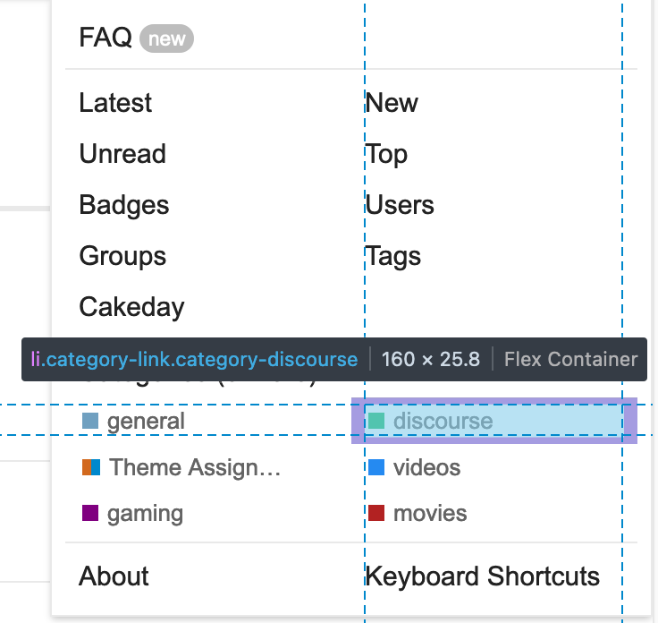

# Category Hider

## Discourse Theme Component

This is a [Discourse](https://discourse.org) theme component that allows you to hide specific categories from either the hamburger menu or category boxes.

**Why would you need this component?** <br>
If your discourse website has a lot of categories and you would like to hide some from appearing in either the menu bar or on the main page, this component can be helpful.

## General Info

🔌 **Plugin Name:** [Discourse Category Hider](https://github.com/keegangeorge/discourse-hide-categories)<br>
🧑‍💻 **Author:** [Keegan George](https://github.com/keegangeorge)<br>
#️⃣ **Version: 1.0**<br>

❓ [Installing Theme Components](https://meta.discourse.org/t/how-do-i-install-a-theme-or-theme-component/63682) <br>
🐙 [GitHub Repository](https://github.com/keegangeorge/discourse-hide-categories) <br>
💬 [Discourse Topic]()

## Installation

Below is a quick start guide to setup your discourse theme. A more comprehensive guide can be found [here](https://meta.discourse.org/t/how-do-i-install-a-theme-or-theme-component/63682).

1. On your discourse website, navigate to:

   ```
   Admin > Customize > Themes > Components
   ```

2. Click `Install` and select `From a git repository`

3. Paste in the following link:
   ```
   https://github.com/keegangeorge/discourse-hide-categories
   ```
4. Navigate to your current theme and select it

5. Include the them component on your current theme.

## Preview

🔭 [Preview on theme creator](https://theme-creator.discourse.org/theme/keegan/category-hider)
<br>

_Before -> After_

<div style="display: flex;">
    </img>
    </img>
</div>

<br>

## Settings

In the settings, you can add what categories you would like to hide for either the category boxes and/or the hamburger category items.

To do that, you must add the HTML class name of the category box or category hamburger link.

</img>

### How do I find what class name a category is?

Often, the class name for the category will be the category name but separated by dashes.

If your adding a hamburger class it will likely be in the format:<br> `.category-your-category-name`

If you adding a category box class, it will likely be in the format:<br> `.category-box-your-category-name`

**To find the exact class name** you can use your web browser's developer tools:

Step 1: Open your browser's developer tools.<br> `Right-click > Inspect Element`

Step 2: Use the keyboard shortcut:<br> **macOS**: `cmd + shift + c` <br> **Windows**: `ctrl + shift + c`

Step 3: Hover over the element you would like to identify the class of.

The class name should appear in the tooltip box.

</img>

For hamburger links, the class name should appear after the class `.category-link`.

For category boxes, the class name should appear after `.category-box`.
