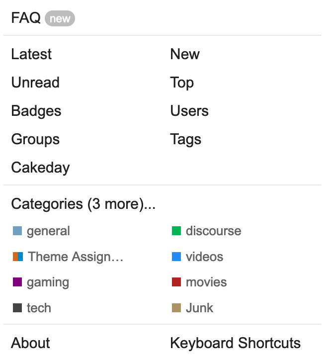
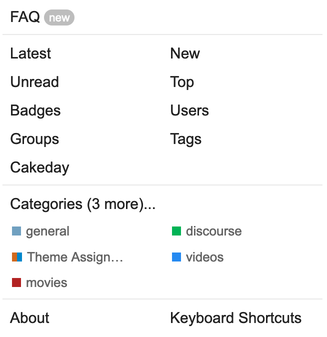
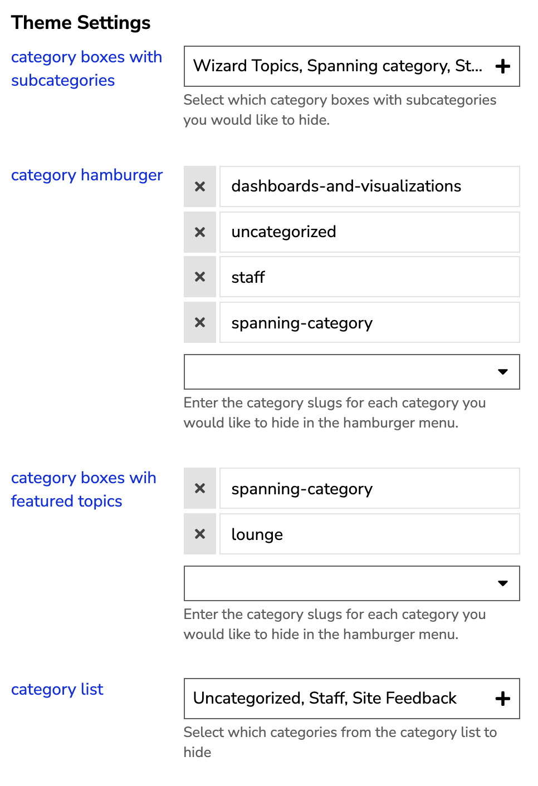

# Category Hider

## Discourse Theme Component

This is a [Discourse](https://discourse.org) theme component that allows you to hide specific categories from either the hamburger menu or category boxes.

**Why would you need this component?** <br>
If your Discourse website has a lot of categories and you would like to hide some from appearing in either the menu bar or on the main page, this component can be helpful.

## General Info

🔌 **Plugin Name:** [Discourse Category Hider](https://github.com/keegangeorge/discourse-hide-categories)<br>
🧑‍💻 **Author:** [Keegan George](https://github.com/keegangeorge)<br>
#️⃣ **Version: 2.0**<br>

❓ [Installing Theme Components](https://meta.discourse.org/t/how-do-i-install-a-theme-or-theme-component/63682) <br>
🐙 [GitHub Repository](https://github.com/keegangeorge/discourse-hide-categories) <br>
💬 [Discourse Topic](https://meta.discourse.org/t/category-hider-theme-component/181299)

## Installation

Below is a quick start guide to setup your discourse theme. A more comprehensive guide can be found [here](https://meta.discourse.org/t/how-do-i-install-a-theme-or-theme-component/63682).

<details>
<summary>View Guide</summary>

1. On your discourse website, navigate to:

   ```
   Admin > Customize > Themes > Components
   ```

2. Click `Install` and select `From a git repository`

3. Paste in the following link:
   ```
   https://github.com/keegangeorge/discourse-hide-categories
   ```
4. Navigate to your current theme and select it

5. Include the them component on your current theme.
</details>

## Preview

🔭 [Preview on theme creator](https://theme-creator.discourse.org/theme/keegan/category-hider)
<br>

_Before -> After_

<div style="display: flex;">
    </img>
    </img>
</div>

<br>

## Settings

In the settings, you can add what categories you would like to hide for different instances/areas where categories appear.

**You can hide categories in:**

- Category Boxes with Subcategories
- Hamburger Menu
- Category Boxes with Featured Topics
- Category List (this type always appears on mobile)

For each setting use either the dropdown to select from the categories or enter the category slug.

</img>
